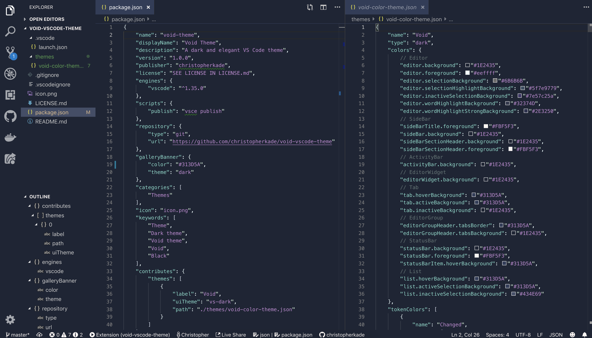

<h1 align="center">Welcome to void-vscode-theme 👋</h1>

  
  
  

> A dark and elegant VS Code theme

## Installation

1.  Install [Visual Studio Code](https://code.visualstudio.com/)
2.  Launch Visual Studio Code
3.  Choose **Extensions** from menu
4.  Search for `Void Theme`
5.  Click **Install** to install it
6.  Click **Reload** to reload the Code
7.  From the menu bar click: Code > Preferences > Color Theme > **Void Theme**

## Author

👤 **Christopher Kade**

* Twitter: [@christo_kade](https://twitter.com/christo_kade)
* Github: [@christopherkade](https://github.com/christopherkade)

## 🤝 Contributing

Contributions, issues and feature requests are welcome ! Feel free to check [issues page](https://github.com/christopherkade/void-vscode-theme/issues).

## Show your support

Give a ⭐️ if this project helped you !

## 📝 License

Copyright © 2019 [Christopher Kade](https://github.com/christopherkade). 
This project is [MIT](https://github.com/christopherkade/lilac-vscode-theme/blob/master/LICENSE.md) licensed.

***
_This README was generated with ❤️ by [readme-md-generator](https://github.com/kefranabg/readme-md-generator)_